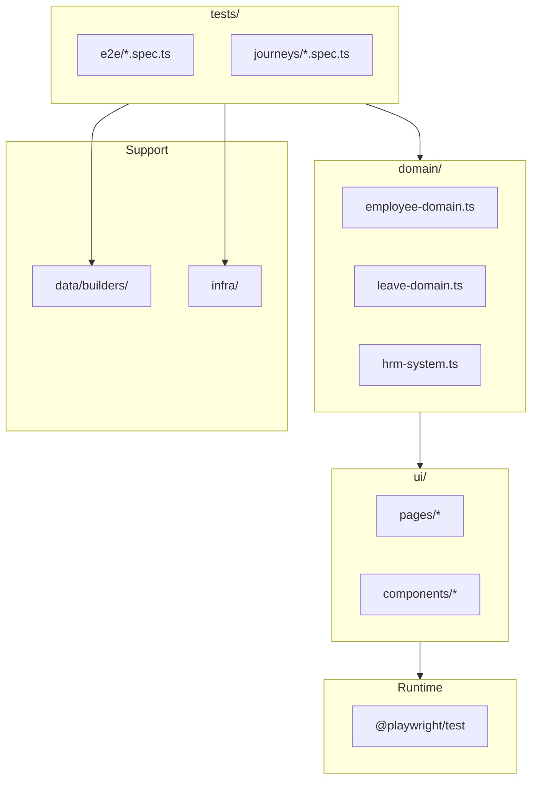
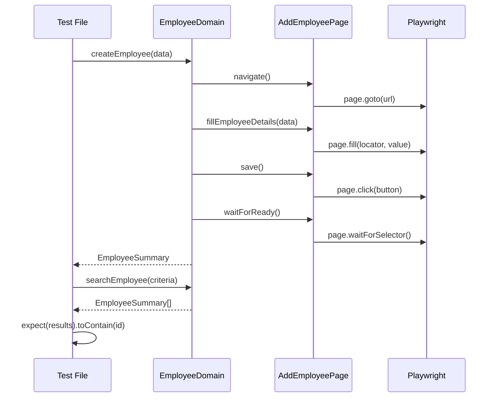
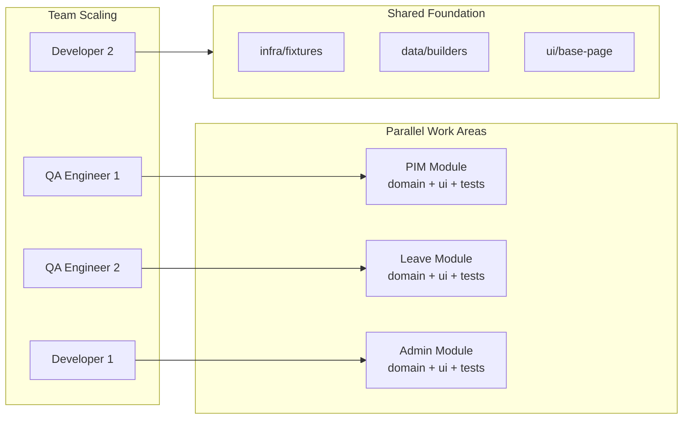

# Architecture

This document explains the layered test architecture, why it exists, what breaks without it, and how it scales.

## Architecture Overview

This framework uses a layered architecture that separates test intent from implementation details. The core principle is that tests express _behaviour_, not _UI scripting_.



The dependency direction is strict: `tests -> domain -> ui -> playwright`. Dependencies flow downward only. No upward imports are allowed.

Support modules (`data/` and `infra/`) sit alongside the layers but are not part of the dependency chain. They provide utilities that any layer can use.

## Layer Responsibilities

### Tests Layer (`tests/`)

Tests describe _what_ the system does, not _how_ to interact with it. A test reads like a business requirement.

**Example from `tests/e2e/pim/add-employee.spec.ts`:**

```typescript
test('should add employee with valid data', async ({ auth, testData }) => {
  const employeeDomain = new EmployeeDomain(auth);
  const createdEmployee = await employeeDomain.createEmployee({
    firstName: 'Test',
    lastName: `Employee${uniqueLastName}`,
    employeeId: uniqueEmployeeId,
  });

  await expect
    .poll(async () => {
      const results = await employeeDomain.searchEmployee({ employeeId: uniqueEmployeeId });
      return results.some((employee) => employee.id === uniqueEmployeeId);
    })
    .toBe(true);
});
```

The test knows nothing about buttons, forms, or page URLs. It expresses intent: create an employee, then verify it exists.

Tests may import:

- Domain objects
- Data factories
- Fixtures from infra

Tests must not import:

- UI pages directly
- Playwright locators
- Raw selectors

### Domain Layer (`domain/`)

Domain objects encapsulate business workflows. They orchestrate UI interactions behind meaningful method names.

**Example from `domain/employee-domain.ts`:**

```typescript
async createEmployee(data: CreateEmployeeInput): Promise<EmployeeSummary> {
  await this.addEmployeePage.navigate();
  await this.addEmployeePage.waitForReady();
  await this.addEmployeePage.fillEmployeeDetails({...});
  await this.addEmployeePage.save();
  await this.waitForOperationCompletion(...);
  return { id, fullName, jobTitle, ... };
}
```

The domain layer:

- Exposes business operations (`createEmployee`, `searchEmployee`, `terminateEmployee`)
- Hides UI navigation and waiting logic
- Returns typed results, not page state

Domain may import UI pages internally, but callers never see UI details.

### UI Layer (`ui/`)

Page objects represent _capabilities_, not DOM structure. A page method should express user intent.

**Responsibilities:**

- Encapsulate locators and selectors
- Handle waiting and synchronization internally
- Ensure actions complete before returning
- Hide implementation from callers

Page methods must not:

- Expose locator objects publicly
- Be thin wrappers around click/fill
- Require callers to add waits

### Support Modules

**`data/`**: Builders and fixtures for generating test data. See `data/builders/employee-builder.ts` for the pattern.

**`infra/`**: Fixtures, configuration, and authentication. The fixture at `infra/test-runner/fixtures.ts` provides authenticated pages, domain instances, and data factories.

Fixtures provide _capabilities_, not workflows. They set up prerequisites but do not encode business logic.

## Dependency Flow



This diagram traces a complete test flow. The test calls domain methods, the domain orchestrates page objects, and pages interact with Playwright. Assertions happen at the test level using domain-returned data.

### What Breaks Without This Structure

When tests bypass the domain layer and interact with UI directly:

1. **Fragility**: Selector changes break tests across multiple files. A button ID change ripples through dozens of tests.

2. **Duplication**: The same login flow gets copy-pasted into every test that needs it.

3. **Unreadable tests**: Tests become sequences of `page.click()`, `page.fill()`, obscuring what behaviour is being tested.

4. **Hidden waits**: Without encapsulation, callers must know when to wait, leading to race conditions or brittle sleeps.

5. **Assertion drift**: Tests verify toast messages instead of persisted state, missing actual failures.

The layered approach contains changes. If the UI changes, only the page object updates. If the workflow changes, only the domain method changes. Tests remain stable.

## Scaling Considerations



As teams grow, this architecture enables parallel work:

### Module Independence

Each business module (PIM, Leave, Admin) has its own domain, pages, and tests. Engineers can work on different modules without stepping on each other.

### Shared Foundation

Common infrastructure lives in shared locations:

- `infra/test-runner/fixtures.ts` provides authentication and test utilities
- `data/builders/` provides data generation that any test can use
- Base page classes in `ui/` provide common interaction patterns

### Clear Ownership

The layer boundaries make ownership obvious:

- Test writers own `tests/`
- Domain experts own `domain/`
- UI specialists own `ui/`
- Infrastructure engineers own `infra/` and `data/`

### Adding New Modules

To add a new module:

1. Create domain class in `domain/`
2. Create page objects in `ui/pages/<module>/`
3. Create tests in `tests/e2e/<module>/`
4. Add domain fixture in `infra/test-runner/fixtures.ts` if needed

No existing code needs modification.

## When to Use This Approach

This layered architecture is appropriate when:

- **Tests exceed 50 files**: The overhead of abstraction pays off at scale.
- **Multiple contributors**: Layer boundaries prevent conflicts.
- **Frequent UI changes**: Page objects isolate selector churn.
- **Long-term maintenance**: Tests that read like requirements survive team turnover.

It may be overkill for:

- Small projects with few tests
- Prototypes or throwaway automation
- Single-contributor scripts

The key question: will someone else need to understand these tests in six months? If yes, the layered approach prevents the decay that makes UI tests unmaintainable.


## When NOT to Use This Architecture

This architecture adds overhead. Skip it when:

 **Under 20 test files**: A single directory with well-named tests suffices. The domain layer abstraction cost exceeds benefit.

 **Prototype or spike work**: Tests written to validate a concept and then discarded. Invest the time elsewhere.

 **Single contributor, short-lived project**: No handoff means no need for architectural guardrails.

 **Smoke tests only**: If you are checking "does the login page load" and nothing more, a simple test file gets the job done.

 **Team lacks TypeScript experience**: The typing discipline required for domain models and builders becomes friction if the team is not comfortable with it.

A practical heuristic: if you can explain what each test does in one sentence and the test file count stays under 30, keep it simple. Add layers when complexity forces you to.